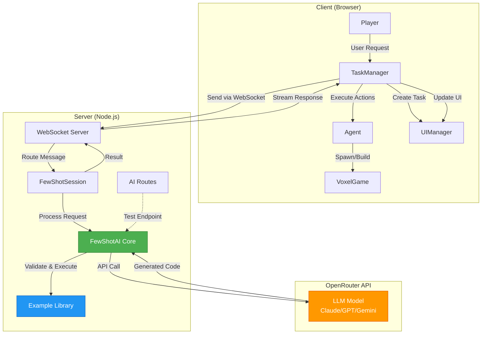
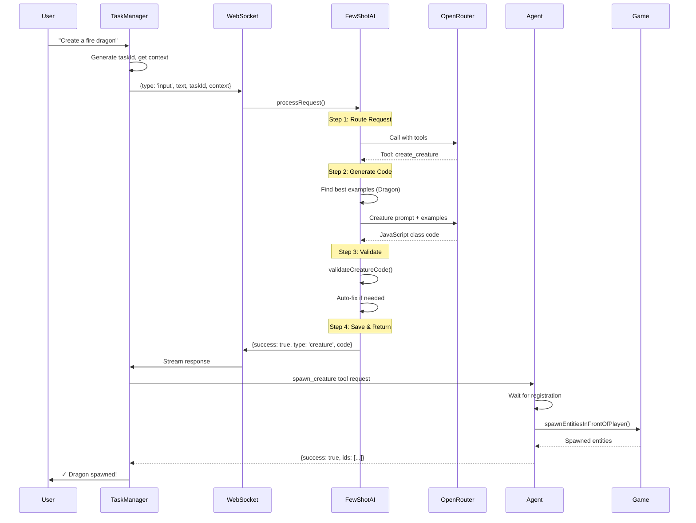
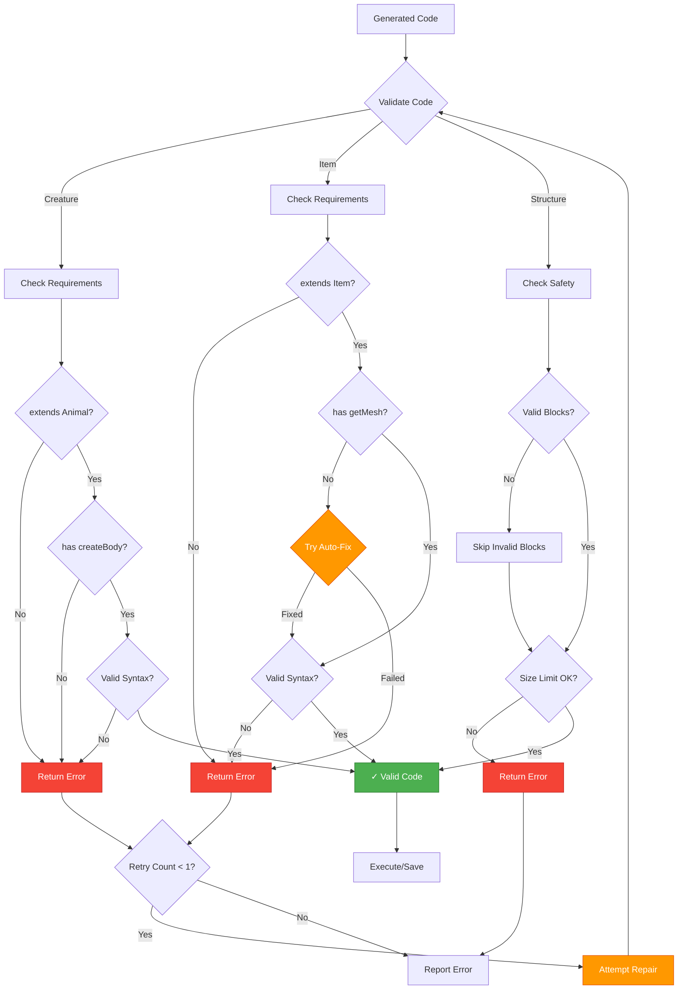

# Few-Shot AI System Architecture

This document describes the architecture of the Few-Shot AI system in VoxelWorld - a specialized AI approach for generating creatures, items, and structures using example-based learning.

## Visual Overview


## System Overview



## Core Components

### 1. FewShotAI (Core Engine)
**Location:** `server/ai/few_shot_system.ts`

The central processing engine that orchestrates the entire few-shot workflow.

**Responsibilities:**
- **Request Routing:** Uses LLM with tool calling to determine intent (creature/item/structure/spawn/give/chat)
- **Code Generation:** Generates JavaScript code using few-shot examples
- **Validation:** Validates generated code for syntax and required patterns
- **Auto-Repair:** Attempts to fix common code issues
- **Structure Execution:** Safely executes structure generation code

**Key Methods:**
```typescript
processRequest(userMessage: string, context: FewShotContext): Promise<FewShotResult>
├── routeRequest() → Determines which tool to use
├── handleCreateCreature() → Generates creature class code
├── handleCreateItem() → Generates item class + SVG icon
├── handleCreateStructure() → Generates block placement code
├── handleSpawnExisting() → Spawns known creatures
└── handleGiveExisting() → Gives known items
```

### 2. FewShotSession (WebSocket Handler)
**Location:** `server/services/FewShotSession.ts`

Manages WebSocket connections and handles client-server communication.

**Responsibilities:**
- WebSocket lifecycle management
- Message routing between client and FewShotAI
- Model selection and configuration
- Result processing and action execution
- Token cost tracking

**Message Flow:**
```typescript
Client → Server
├── input: User request with context
├── set_model: Change LLM model
├── get_models: Request available models
├── interrupt: Stop generation
└── tool_response: Client tool execution result

Server → Client
├── token: Streamed text response
├── thinking: Processing indicator
├── code: Generated code display
├── complete: Request finished
├── error: Error message
└── model_changed: Model switch confirmation
```

### 3. Example Library
**Location:** `server/ai/examples/`

Pre-built, high-quality examples that serve as templates for the LLM.

**Files:**
- `creatures.ts` - Animal/monster examples (Bunny, Dragon, Robot, etc.)
- `items.ts` - Item examples (Wands, Swords, Potions)
- `structures.ts` - Building examples (House, Tower, Pyramid, Bridge)

**Selection Algorithm:**
```typescript
findBestExamples(userRequest: string, count: number)
├── Extract keywords from user request
├── Score each example by keyword matches
├── Return top N scoring examples
└── Used in prompt construction
```

### 4. Prompt System
**Location:** `server/ai/few_shot_prompts.ts`

Constructs specialized prompts for each generation type.

**Prompts:**
1. **Router Prompt** - Determines which tool to call
2. **Creature Prompt** - Creates Animal classes with THREE.js meshes
3. **Item Prompt** - Creates Item classes with getMesh() and SVG icons
4. **Structure Prompt** - Generates block placement code
5. **Chat Prompt** - Handles general conversation

**Prompt Structure:**
```
System Instructions (Rules & Requirements)
↓
Similar Working Examples (2-3 best matches)
↓
User Request
↓
Task Description (What to generate)
```

### 5. TaskManager (Client)
**Location:** `src/game/ai/TaskManager.js`

Client-side queue manager for AI requests.

**Responsibilities:**
- Task queue management (pending → running → completed/error)
- Active AI client selection (FewShot vs Merlin)
- Context gathering (player position, direction, terrain height)
- Message routing to/from server
- UI updates and notifications

**Task Lifecycle:**
```javascript
createTask(prompt, category)
↓
processQueue() → startTask(taskId)
↓
Send to AI client with context
↓
handleMessage(msg) → Stream updates
↓
completeTask() or failTask()
↓
Execute next task in queue
```

### 6. Agent (Client)
**Location:** `src/game/entities/Agent.js`

Client-side tool executor that performs game actions.

**Available Tools:**
- `spawn_creature` - Spawn entities (with retry for new creatures)
- `set_blocks` - Place blocks in the world
- `give_item` - Add items to inventory (with retry for new items)
- `teleport_player` - Move player to location
- `spawn_tree` - Generate trees
- `fill_blocks` - Fill regions with blocks

**Context Gathering:**
```javascript
getTaskContext()
├── Player position (x, y, z)
├── Camera direction (dirX, dirZ)
├── Target position (10 blocks ahead)
├── Terrain height at target (for structures)
└── World ID
```

## Data Flow

### Request Flow Diagram



### Complete Request Flow

```
1. User Input
   "Create a fire-breathing dragon"
   ↓
2. TaskManager.createTask()
   ├── Generate taskId
   ├── Add to queue
   └── Get context (position, direction, terrain)
   ↓
3. WebSocket → FewShotSession
   { type: 'input', text: '...', taskId, context }
   ↓
4. FewShotAI.processRequest()
   ├── Step 1: Route Request (LLM + Tools)
   │   → Tool: create_creature
   │
   ├── Step 2: Generate Code
   │   ├── Find best examples (Dragon, Flying creature)
   │   ├── Build creature prompt
   │   └── Call OpenRouter API
   │       → Returns JavaScript class code
   │
   ├── Step 3: Validate Code
   │   ├── Check for "extends Animal"
   │   ├── Check for "createBody()"
   │   ├── Syntax validation
   │   └── Auto-fix if needed
   │
   └── Step 4: Return Result
       { success: true, type: 'creature', code: '...' }
   ↓
5. FewShotSession.handleCreatureResult()
   ├── Save creature to DynamicCreatureService
   ├── Stream response to client
   └── Request client tool: spawn_creature
   ↓
6. Agent.handleToolRequest()
   ├── Wait for creature registration (retry loop)
   ├── Call game.spawnManager.spawnEntitiesInFrontOfPlayer()
   └── Return success/error
   ↓
7. TaskManager.completeTask()
   ├── Update task status
   ├── Show notification
   └── Process next task in queue
```

### Context Flow

```
Client Context Gathering:
├── Player position (from game.player)
├── Camera direction (from game.camera)
├── Target position calculation (10 blocks ahead)
│   ├── targetX = playerX + dirX * 10
│   ├── targetZ = playerZ + dirZ * 10
│   └── targetGroundY = worldGen.getTerrainHeight(targetX, targetZ)
└── World ID (from game.currentWorldId)

Server Context Usage:
├── playerPosition → For relative positioning
├── targetPosition → For structure placement at ground level
├── playerDirection → For forward-facing structures
└── worldId → For saving creatures/items
```

## Validation & Safety

### Validation Flow Diagram



### Code Validation

**Creature Validation:**
```javascript
validateCreatureCode(code)
├── Must extend Animal class
├── Must have createBody() method
├── Must use THREE.js for meshes
├── Must add meshes to this.mesh
└── No syntax errors (Function constructor test)
```

**Item Validation:**
```javascript
validateItemCode(code)
├── Must extend Item or WandItem
├── Must have getMesh() method
├── Must call super() in constructor
└── No syntax errors
```

**Auto-Repair:**
- Add missing getMesh() for items
- Insert default implementations
- Fix common syntax issues

### Structure Safety

**Execution Sandbox:**
```javascript
executeStructureCode(code, context)
├── Create isolated Function scope
├── Inject playerPosition only
├── Execute code
├── Return blocks array
└── Catch and report errors
```

**Block Validation:**
- Check for valid x, y, z coordinates
- Validate block ID against available blocks
- Skip invalid blocks (don't crash)

## API Endpoints

### HTTP Routes
**Location:** `server/routes/ai.ts`

**Test Endpoints:**
- `GET /api/ai/fewshot/models` - List available models
- `POST /api/ai/fewshot/examples` - Find matching examples
- `POST /api/ai/fewshot/test` - Test generation without WebSocket

### WebSocket Messages

**Client → Server:**
```typescript
{ type: 'input', text: string, context: object, taskId?: string }
{ type: 'set_model', model: string }
{ type: 'get_models' }
{ type: 'interrupt' }
{ type: 'tool_response', id: string, result: any }
```

**Server → Client:**
```typescript
{ type: 'token', text: string, taskId?: string }
{ type: 'thinking', message: string }
{ type: 'code', code: string, language: string, description: string }
{ type: 'complete', taskId?: string }
{ type: 'error', message: string }
{ type: 'models_list', models: Model[] }
{ type: 'model_changed', model: string }
```

## Model Support

### Available Models (OpenRouter)

**Claude (Anthropic):**
- claude-opus-4.6 (Strongest, 1M context)
- claude-sonnet-4.5 (Best balance)
- claude-haiku-4.5 (Fast & cheap)

**GPT (OpenAI):**
- gpt-5.2-pro (Most advanced)
- gpt-5.2-codex (Optimized for code)
- gpt-4.1-mini (Budget)

**Gemini (Google):**
- gemini-3-pro-preview (Flagship)
- gemini-3-flash-preview (Fast)
- gemini-2.5-flash (Budget)

**Budget:**
- deepseek-chat (Very cheap, good for code)

### Model Selection Strategy

```javascript
getActiveClient()
├── Check if FewShot explicitly disabled
├── Use FewShot by default (faster, cheaper, specialized)
└── Fallback to Merlin only if unavailable
```

## Error Handling

### Generation Errors

**Creature/Item Creation:**
1. Validation fails → Attempt auto-repair
2. Repair fails → Return error with details
3. Spawn/give tool errors → Retry with delay (race conditions)

**Structure Creation:**
1. Code execution error → Catch and report
2. Invalid blocks → Skip invalid, continue with valid
3. No blocks generated → Return error

### Client-Server Sync

**Race Conditions:**
- New creatures may not be registered immediately
- New items may not be in ItemManager yet
- **Solution:** Polling with timeout (2-3 seconds max)

**Connection Loss:**
- WebSocket reconnection handled by base client
- Tasks in queue preserved
- Show connection status to user

## Performance

### Optimization Strategies

**Token Usage:**
- Few-shot cost: ~2 tokens (minimal charge)
- Examples cached in memory
- Context limited to relevant data

**Response Speed:**
- Fast routing (<1s with Haiku)
- Streaming responses (token by token)
- Background AI client connection

**Caching:**
- Example library loaded once
- Field search cached (semantic search)
- Known creatures/items cached

## Future Enhancements

### Planned Features
1. **Context-Aware Examples** - Use biome, time, nearby creatures
2. **Learning from Feedback** - Track successful vs failed generations
3. **Multi-Step Generation** - Complex creatures with behaviors
4. **Visual Feedback** - Preview before spawning
5. **Collaborative Creation** - Multiple players co-create

### Scalability
- Add more examples to library
- Support custom example injection
- Multi-language model support
- Fine-tuned models for specific tasks

## Testing

### Manual Testing
```bash
# Start server
npm run dev

# Test endpoints
curl -X POST http://localhost:5173/api/ai/fewshot/test \
  -H "Content-Type: application/json" \
  -d '{"prompt": "create a fire dragon", "model": "anthropic/claude-3-haiku"}'
```

### Automated Testing
- Unit tests for validation functions
- Integration tests for full flow
- Example quality tests (code must execute)

---

## Quick Reference

### Key Files
```
server/
├── ai/
│   ├── few_shot_system.ts      # Core engine
│   ├── few_shot_prompts.ts     # Prompt templates
│   ├── few_shot_tools.ts       # Tool definitions
│   └── examples/
│       ├── creatures.ts         # Creature examples
│       ├── items.ts             # Item examples
│       └── structures.ts        # Structure examples
├── services/
│   ├── FewShotSession.ts       # WebSocket handler
│   ├── DynamicCreatureService.ts
│   └── DynamicItemService.ts
└── routes/
    └── ai.ts                    # HTTP endpoints

src/game/
├── ai/
│   └── TaskManager.js           # Client task queue
└── entities/
    └── Agent.js                 # Client tool executor
```

### Common Commands
```javascript
// Change model (client-side)
taskManager.getActiveClient().send({ type: 'set_model', model: 'anthropic/claude-haiku-4.5' })

// Get available models
taskManager.getActiveClient().send({ type: 'get_models' })

// Create task
taskManager.createTask('create a fire-breathing dragon', 'creature')

// Interrupt generation
taskManager.getActiveClient().send({ type: 'interrupt' })
```

### Debug Tips
- Check console for `[FewShotAI]` logs
- Validate examples: `/api/ai/fewshot/examples`
- Test generation: `/api/ai/fewshot/test`
- Inspect WebSocket messages in browser DevTools

---

**Architecture Version:** 1.0
**Last Updated:** 2026-02-09
**Maintainer:** VoxelWorld Team
